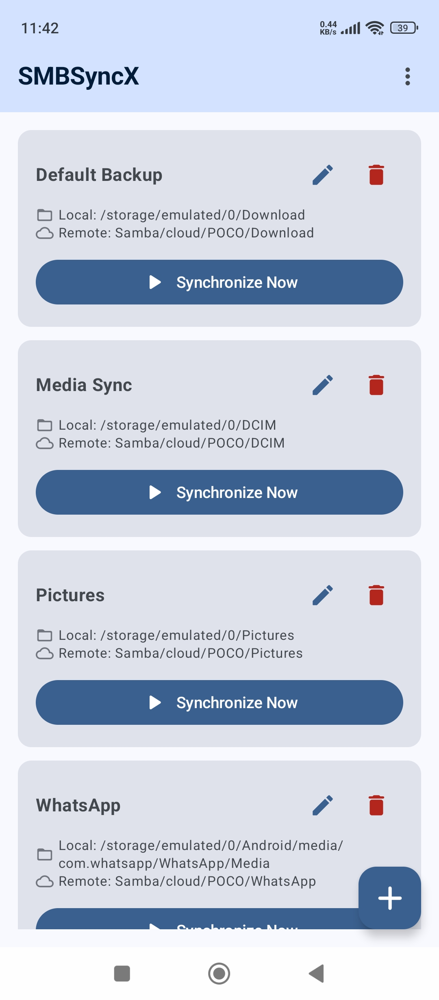

SMBSyncX is a powerful tool designed to synchronize files between your Android device and an SMB/Windows share.

## Features

    Real-time sync progress: Watch files move with smooth indicators.
    Full storage access: Includes hidden (.dot) files and all file types (PDF, TXT, etc).
    Persistent sync profiles: Your settings stay safe using Jetpack DataStore.
    Adaptive UI: Optimized for phones, foldables, and tablets.

## Credits

Developed with using Jetpack Compose, Material 3, and the SMBJ library.
